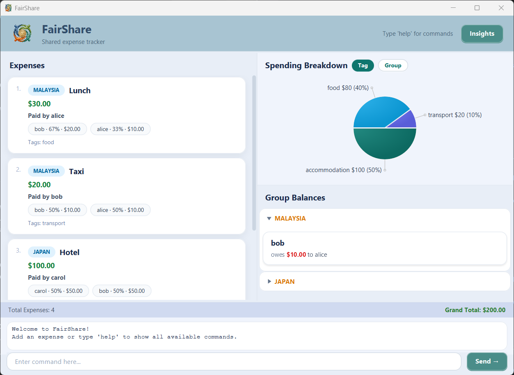

# FairShare User Guide

FairShare is a shared expense tracker that helps groups manage and split costs fairly. 
Whether you are on a trip with friends, sharing household bills with housemates, or splitting work lunches with colleagues, FairShare keeps track of who owes whom and how much.

---

## Table of Contents
- [Quick Start](#quick-start)
- [Features](#features)
- [Managing Expenses](#managing-expenses)
  - [Adding an Expense](#adding-an-expense-equal-split-add)

---

## Quick Start

1. Ensure you have **Java 21** or above installed on your computer.

2. Download the latest `fairshare.jar` file from [releases page](https://github.com/nus-cs2103de-ay2526s2-grp6/tp/releases).

3. Copy the file to a folder you want to use as the home folder for FairShare.

4. Open a command terminal, navigate to that folder, and run:
```
   java -jar fairshare.jar
```

5. A GUI similar to the below should appear:

    // replace with fairshare screenshot

6. Type commands in the input box and press **Send** (or press Enter) to execute them.

7. Try these example commands:
    - `help` : Shows all available commands
    - `add n/lunch a/30.0 g/malaysia p/alice s/alice s/bob s/carol t/food` : Adds an expense entry
    - `list` : Lists all recorded expenses
    - `filter g/malaysia` : Filters expenses named under the group `Malaysia`
    - `exit` : Exits the app

---

## Features

> **Notes about command format:**
> - Words in `UPPER_CASE` are parameters you supply.
> - Items in `[square brackets]` are optional.
> - Parameters with `...` can be repeated e.g. `s/PERSON...`
    >   means you can add multiple participants.
> - Group names are **case-insensitive** — `Malaysia` and
    >   `malaysia` refer to the same group.

---

## Managing Expenses

### Adding an expense (equal split): `add`

Adds a new shared expense where the cost is split equally
among all participants.

**Format: `add n/NAME a/AMOUNT g/GROUP p/PAYER s/PERSON...[t/TAG...]`**

